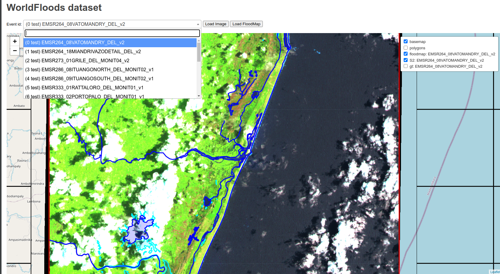

## *WorldFloods* viewer

Flask web application to view and label the *WorldFloods* extended dataset. It requires 
that some part of the dataset is downloaded in the hard disk (it could be copied from `gs://ml4cc_data_lake/2_PROD/2_Mart/worldfloods_extra_v2_0`)

```bash
python serve.py --root_location /path/to/worldfloods_extra_v2
```


